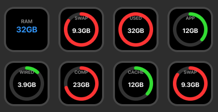

# Mac Memory Monitor

Real-time macOS memory monitoring for Stream Deck with color-coded progress rings.

## Metrics

- **RAM** - Total physical memory
- **Used** - Memory in use
- **App** - Application memory
- **Wired** - Locked memory
- **Compressed** - Compressed memory
- **Cached** - File cache
- **Swap** - Swap usage (green → yellow → red)

## Install

**Elgato Marketplace:** Search for "Mac Memory Monitor"

**Direct:** Download from [Releases](https://github.com/joshroman/streamdeck-macos-memory/releases)

## Requirements

- macOS 10.15+
- Stream Deck 6.6+

## License

MIT
